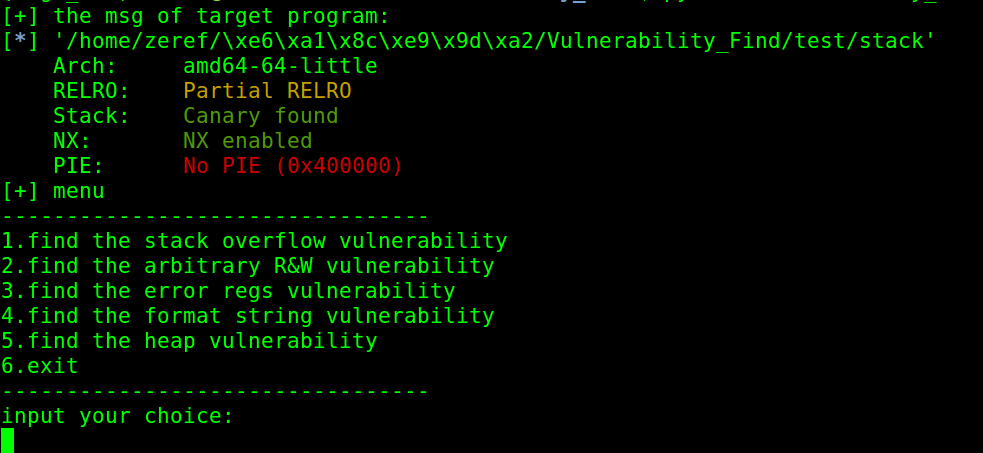

# 简介

基于angr做的漏洞自动挖掘python程序

目前仅能完python程序成简单程序的漏洞挖掘，仅在Ubuntu1604下测试64位elf

能漏洞类型有：栈溢出、格式化字符串（仅printf函数）、uaf/double_free（仅libc2.23下的malloc和free）、任意地址读写、寄存器错误

# 安装angr虚拟环境

cd ~

git clone https://github.com/23R3F/AutoFindBug.git

cd AutoFindBug

chmod u+x ./install_env.sh && ./install_env.sh

# 使用

本程序安装在python的虚拟化环境里，因此在运行前需要切换python环境，输入命令angr_env即可切换

命令行使用规则为：

`python Vulnerability_Find.py [-h] [-l ARGS_SIZE] [-n ARGS_NUM] [-s START_ADDR] [-t RUN_TIME] file`

其中必填项为file选项，是指要被测试挖掘的目标程序的路径

-l和-n用于需要执行时输入参数的程序，可以设置参数的数量和大小，默认为不输入参数

-s表示进行程序执行的起点函数地址，可用于只测试某些指定的函数，默认从main函数开始进行测试

-t用于指定漏洞挖掘的上限时间，默认是20分钟。

主界面如下

# 测试

栈溢出+格式化字符串测试，进入主界面后可选1、4

`python Vulnerability_Find.py ./test/stack`

任意地址读写和寄存器错误测试，进入主界面后可选2、3

`python Vulnerability_Find.py ./test/arbreg`

uaf和double free测试，进入主界面后可选5

`python Vulnerability_Find.py ./test/heap`

